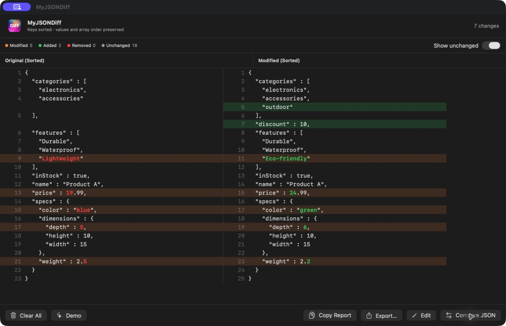

# MyJSONDiff

MyJSONDiff is a clean, fast, native macOS app for comparing two JSON documents side by side. It normalizes object key order before diffing, so the results focus on real changes instead of formatting noise.

## Screenshot



## Website

Official site: https://www.xnu.app/jsondiff

## Download

App Store: https://apps.apple.com/us/app/myjsondiff/id6742816661

## Features

- Side-by-side JSON editors with a clear, readable layout
- Order-insensitive comparison via deterministic alphabetized key sorting
- Professional diff visualization with added/removed/changed highlights
- Handles nested objects and arrays
- Color-coded output for quick scanning
- Fully local processing with no network access
- Native light and dark mode support
- Keyboard shortcuts and VoiceOver-friendly controls

## How It Works

1. Paste JSON A on the left
2. Paste JSON B on the right
3. Click "Compare JSON"
4. The tool sorts both objects by key order
5. A structured, side-by-side diff is generated

### Diff Legend

- **Added** (green): present on the right, missing on the left
- **Removed** (red): present on the left, missing on the right
- **Changed** (yellow): same key, different value

## Tech Stack

- Swift and SwiftUI
- Foundation `JSONSerialization` for parsing and deterministic sorted-key formatting
- A native Swift line-diff engine

## Local Development

```bash
open JSONDiff/JSONDiff.xcodeproj
```

Or build from the command line:

```bash
xcodebuild -project JSONDiff/JSONDiff.xcodeproj \
  -scheme JSONDiff \
  -destination 'platform=macOS' \
  CODE_SIGNING_ALLOWED=NO build
```

## Contributing

Issues and pull requests are welcome.

## License

MIT

## Star History

[](https://star-history.com/#everettjf/jsondiff&Date)
